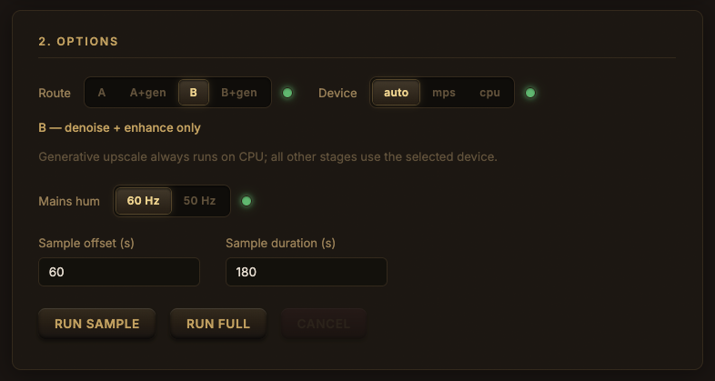
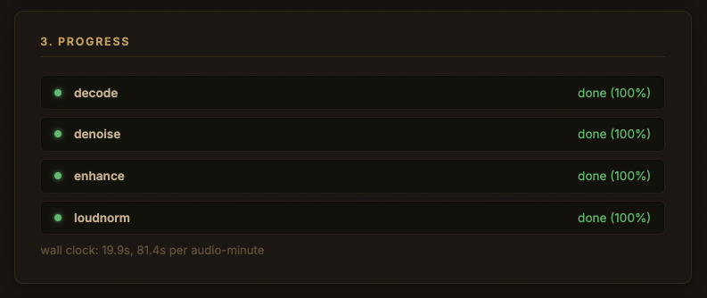
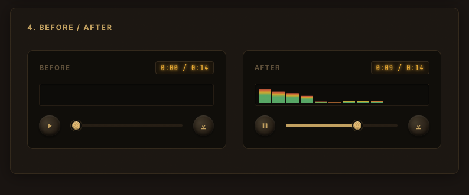

# cassette-re-wired


📼 Because those old lecture MP3s deserve better than hiss and static!

This is a fun little project for cleaning up and enhancing old speech and lecture recordings, reducing background noise and improving audio quality to preserve them better and make them more enjoyable to listen to.
Drop in an audio file — any format ffmpeg can decode (MP3, M4A/AAC, WAV, FLAC, OGG,
etc.), since decoding just shells out to ffmpeg with no format allowlist — process a
short excerpt, A/B it against the original, and run the full file only once the
sample sounds right.

## What is it technically!

Three stages: **denoise → speech enhancement (bandwidth extension) → loudness
normalisation**, driven by open-source CLI tools from a small Node/TypeScript UI.
Everything runs on one machine. No cloud, no accounts, no API keys.

> **Target content: speeches and lectures.** This tool is designed for and tested on
> spoken-word recordings — university lectures, conference talks, panel discussions,
> oral history tapes. It has **not** been tested on music, podcasts with heavy
> production, or multi-speaker crosstalk.

## How it works

The pipeline decodes the source file once to lossless WAV, runs enhancement stages in
WAV, and only re-encodes to MP3 at final export — no quality is lost to intermediate
re-encoding.

**Route A** (default):

```
MP3 → WAV (decode) → resemble-enhance (denoise / upscale) → loudness normalisation → MP3
```

**Route B** (optional, for noisier sources):

```
MP3 → WAV (decode) → highpass + notch filter → DeepFilterNet → resemble-enhance → loudness normalisation → MP3
```

Route B adds [DeepFilterNet](https://github.com/Rikorose/DeepFilterNet) as a
dedicated pre-cleaning stage. It gives resemble-enhance a cleaner input to work from;
the enhance stage still runs in both routes.

### Denoise-only vs. full enhance

**Denoise-only is the default.** The `--denoise_only` flag skips the generative
upscale pass and applies only the denoising model. In practice, denoising alone
produces a clearly audible improvement on old recordings — cleaner background, less
hiss, better intelligibility — without any risk of generative artifacts.

The generative upscale (bandwidth extension) is available as an opt-in experiment.

## Why the audition step matters

The upscale stage is **generative** — it invents plausible high-frequency detail
rather than recovering data the MP3 encoder discarded. That data is gone. The output
is a gamble that has to be listened to, which is why this has a GUI with A/B playback
instead of being a shell script.

## What to expect

**Denoising and enhancement** produce a visible (and audible) improvement even on old,
low-bitrate, tape-converted MP3 speech recordings. Background hiss, room noise, and
mains hum are substantially reduced; speech becomes clearer and more present.

**Generative upscaling** results vary. The quality of the upscale depends on several
factors:

- **Source bitrate and codec artifacts** — lower-bitrate MP3s have more spectral
  smearing and pre-echo baked in. The model may amplify these rather than fix them.
- **Background noise type** — steady-state noise (HVAC, hum) is handled well;
  transient noise (coughs, rustling, audience) can confuse the generative model.
- **Reverberation** — lecture halls with long reverb tails smear the spectral envelope
  the model relies on, producing doubling or ghosting artifacts.
- **Speaker characteristics vs. training data** — the model's training corpus skews
  toward certain voice types. Atypical pitch ranges, accents, or vocal qualities may
  fall outside its learned distribution.
- **Microphone quality and placement** — distant-mic recordings (podium mics picking
  up the whole room) yield worse results than close-mic or lapel recordings.
- **Clipping and saturation** — clipped peaks destroy waveform shape in ways that are
  fundamentally unrecoverable.
- **Multiple overlapping speakers** — the model expects a single dominant speaker;
  crosstalk degrades output quality.
- **Prior lossy processing** — each prior re-encode (MP3 → AAC → MP3) stacks
  artifacts multiplicatively.

The denoise-only mode avoids all generative risk and is recommended as the starting
point. Enable the full upscale only after listening to the denoise-only result.

## Tools used

| Tool | Purpose | License |
| --- | --- | --- |
| [resemble-enhance](https://github.com/resemble-ai/resemble-enhance) | Speech denoising and generative super-resolution | MIT |
| [DeepFilterNet](https://github.com/Rikorose/DeepFilterNet) | Real-time noise suppression (optional Route B pre-clean) | MIT / Apache-2.0 |
| [FFmpeg](https://github.com/FFmpeg/FFmpeg) | Audio decoding, filtering, loudness normalisation, final encode | LGPL-2.1+ |

## Prerequisites

Developed and tested on macOS with Apple Silicon; a Windows build is also produced
(see [ADR 0001](docs/adr/0001-local-web-app-with-electron-shell.md)) but has seen less
real-world use. The full flow — dev server, Electron app, and pipeline run through to
before/after playback — has been tested successfully end-to-end on an Apple M4 Pro
macOS machine. It has not been verified on Intel Macs or Windows — issues and
contributions covering those are welcome.

### Pipeline run (`npm run dev` / `npm run electron:dev`, actually processing audio)

FFmpeg/ffprobe need no separate install — `npm install` pulls the
[`ffmpeg-static`](https://www.npmjs.com/package/ffmpeg-static)/
[`ffprobe-static`](https://www.npmjs.com/package/ffprobe-static) devDependencies, and
`src/config.ts` uses those binaries by default on every platform. Override with
`CASSETTE_FFMPEG`/`CASSETTE_FFPROBE` if you want a specific system install instead.

The Python tools need a **pinned virtualenv on Python 3.10/3.11** — newer Python
versions are incompatible with `resemble-enhance`'s dependency pins. See
[ADR 0005](docs/adr/0005-pinned-python-venv.md). The app expects this venv at
`~/.cassette-rewired/.venv` by default (override with `CASSETTE_PYTHON_VENV`):

```bash
brew install uv
uv venv --python 3.11 ~/.cassette-rewired/.venv
uv pip install --python ~/.cassette-rewired/.venv/bin/python resemble-enhance
uv pip install --python ~/.cassette-rewired/.venv/bin/python deepfilternet  # optional; provides `deepFilter`
```

`resemble-enhance` fetches its model weights (~680 MB) from Hugging Face via `git
clone` + `git lfs pull` on first invocation, so **git-lfs must be installed first**:

```bash
brew install git-lfs
git lfs install
```

Notes on the Python tools (the app handles both automatically):

- The installed console script is named **`resemble-enhance`** (hyphen), not
  `resemble_enhance` (underscore). On Windows, venv console scripts live under
  `Scripts\` with a `.exe` suffix instead of `bin/` — the app resolves this per
  platform automatically.
- Its `--device` flag defaults to `cuda`. On Apple Silicon, the app passes
  `--device mps` or `--device cpu` explicitly; on Windows/NVIDIA it passes
  `--device cuda`. `PYTORCH_ENABLE_MPS_FALLBACK=1` is set for the MPS case since some
  ops aren't implemented on MPS yet.
- The generative upscale pass is memory-intensive and may slow down the machine on
  MPS or a modest GPU. The app forces `--device cpu` whenever generative upscale is
  enabled; the device dropdown only takes effect in denoise-only mode.

Run `GET /preflight` (or check the UI) after setup — it validates FFmpeg, the venv,
and the `resemble-enhance` binary and reports exactly what's missing.

### Dev server (`npm run dev`) and Electron dev (`npm run electron:dev`)

Node 22+ is required for the server and UI. `npm install` then `npm run dev` is
enough to get the browser app up, with FFmpeg/ffprobe already covered by
`ffmpeg-static`/`ffprobe-static`; you still need the Python venv above to actually
run a file through it.

### Electron build (`npm run electron:build`)

`electron-builder` rebuilds native modules for packaging and needs a plain
**`python3` on `PATH`** — any recent version, unrelated to the pinned
resemble-enhance/DeepFilterNet venv above.

`npm run electron:build` produces a **fully standalone app**: it bundles ffmpeg,
ffprobe, a dedicated Python 3.11 install (resemble-enhance + DeepFilterNet + CPU
torch), and **both models' weights**, so the installed app needs nothing from the
prerequisites above at runtime — no system ffmpeg, no user-created venv, no
network access, no git, no git-lfs. This only affects the build output; `npm run
dev` and `npm run electron:dev` are unchanged and still use
`ffmpeg-static`/`ffprobe-static` from npm and `~/.cassette-rewired/.venv`.

A `predist` step (`scripts/build-python-venv.mjs`) downloads a standalone CPython
interpreter, installs dependencies into it directly (not a venv — see the script's
top comment for why), **prefetches both models' weights**, and stages ffmpeg/ffprobe
under `build-cache/` before `electron-builder` packages it all via `extraResources`.
Requirements, all on the **build machine only** — none of these are needed by the
machine that later runs the packaged app:

- **Network access, `git`, and `git-lfs`** — used once to prefetch
  resemble-enhance's ~680 MB of model weights (`git clone` + `git lfs pull`).
  Cached under `build-cache/weights-cache/` across builds, so only the very first
  build on a given machine pays this cost; `rm -rf build-cache/weights-cache` forces
  a fresh pull (e.g. after an upstream model update). DeepFilterNet's much smaller
  (~8 MB) model comes over plain HTTPS, no git needed.
- **Build on the machine matching your target.** `electron:build` packages the host's
  own platform+arch only — there's no cross-compilation. To ship a macOS Apple
  Silicon build, run it on an Apple Silicon Mac; for Intel macOS, an Intel Mac; for
  Windows, a Windows x64 machine.
- **Windows 32-bit (ia32) is not supported** — PyTorch publishes no ia32 Windows
  wheels, so `scripts/build-python-venv.mjs` refuses to build one. Windows x64 only.
- Regenerate `python-requirements/lock.txt` deliberately (not on every build) when
  bumping resemble-enhance/DeepFilterNet/torch versions.
- The macOS DMG is unsigned (no code signing/notarization) — this is a personal
  testing tool, not a distributed product. Open it once via right-click → Open to
  bypass Gatekeeper's first-launch check.
- The DMG is large (~1.2 GB) because of the bundled weights — this is the deliberate
  trade-off for zero runtime network/git dependency.

Verified (2026-08-13): launched the packaged app directly with a stripped,
`launchd`-style environment (`PATH=/usr/bin:/bin:/usr/sbin:/sbin`, no Homebrew, no
pre-existing caches) and ran both Route A and Route B sample runs to completion with
no network access and no `git` process spawned at any point.

## Screenshots

**Options** — choose route, device, mains-hum filter, and sample window before running:



**Progress** — per-stage status with wall-clock timing for extrapolating full-run cost:



**Before / After** — A/B playback with synced transport to audition the result:



## Running

As a browser app:

```bash
npm install
npm run dev   # starts on http://127.0.0.1:4310, with HMR for the renderer
```

As a desktop app (Electron — see [ADR 0001](docs/adr/0001-local-web-app-with-electron-shell.md)):

```bash
npm run electron:dev     # build once, then open a native window
npm run electron:build   # produce a macOS .dmg and a Windows installer under release/
```

## Hard constraints

These are correctness issues, not preferences:

- **Decode once, stay lossless in the middle.** MP3 → WAV at the start, WAV for every
  intermediate stage, MP3 only at final export.
- **Never hand-roll fixed audio cuts.** Let `resemble-enhance` chunk internally;
  naive cuts leave audible seams at every boundary.
- **Sample rates differ between stages.** DeepFilterNet wants 48 kHz in;
  resemble-enhance emits 44.1 kHz. Carry the rate explicitly per stage.

## ADRs

| Decision | ADR |
| --- | --- |
| Local web app on `127.0.0.1`, wrapped in Electron; not Tauri | [0001](docs/adr/0001-local-web-app-with-electron-shell.md) |
| Shell out to the CLIs; no Python sidecar | [0002](docs/adr/0002-shell-orchestration.md) |
| One directory per run on disk, no database | [0003](docs/adr/0003-filesystem-run-state.md) |
| Preview encodes never re-enter the export chain | [0004](docs/adr/0004-preview-artifacts-quarantined.md) |
| App-owned pinned Python virtualenv | [0005](docs/adr/0005-pinned-python-venv.md) |
